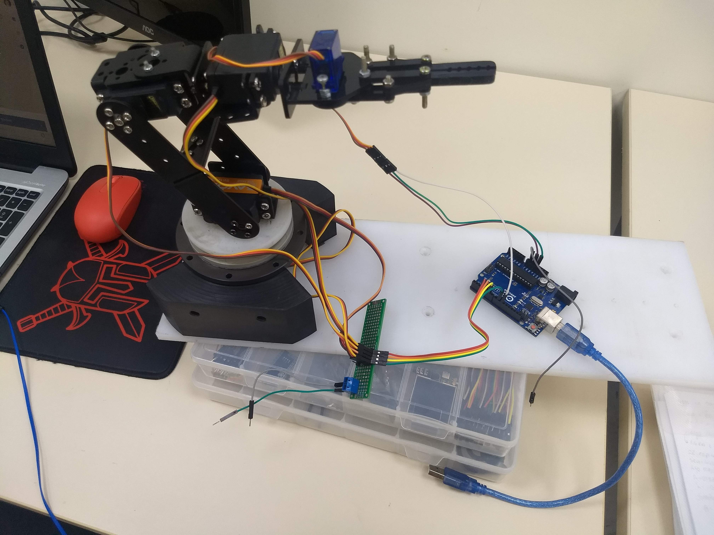
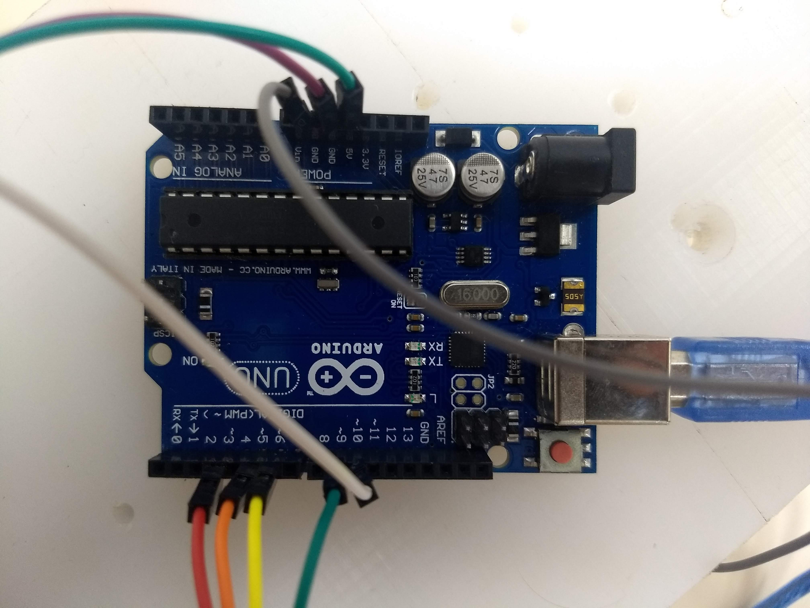
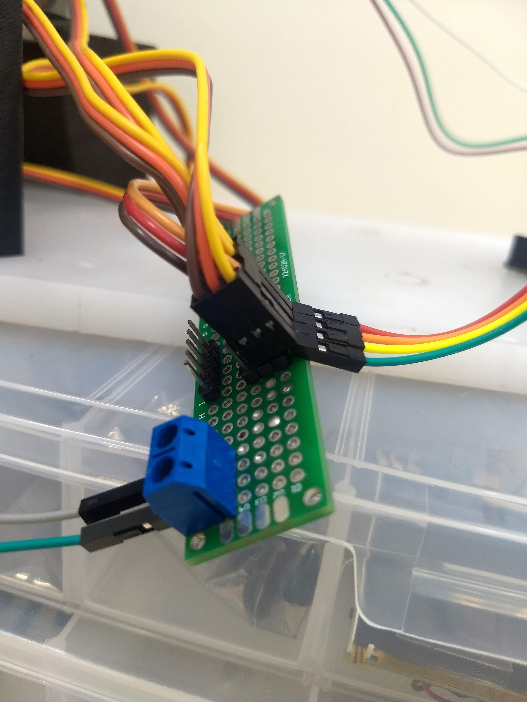

# ROS - Five Dof Robot Arm

## Instruções!
- Ligue o Arduino ao computador
- Alimente somente a garra com o próprio Arduino (5V)
- Alimente o resto braço robótico com uma fonte externa em (6V) 
- Não esqueça de verificar se a corrente da fonte está limitada 
- Conecte o ground do Arduino junto ao ground da fonte
- Carregue o código da pasta five_dof_arm_test/arduino_code_peve.ino para 		o seu Arduino UNO

## Pinos

Abaixo estão dispostos os servos e seus respectivos pinos no Arduino UNO.

| Servo | Pino |
| ------ | ------ |
| Servo 1 (Base)  | ~ 3 |
| Servo 2 		  | ~ 5 |
| Servo 3 		  | ~ 6 |
| Servo 4 		  | ~ 9 |
| Servo 5 (Garra) | ~ 10|

## Rodar o programa 
Rodar o node principal:
```sh
$ roscore
```
Cria os nodes subscrible do arduino:
```sh
$ rosrun five_dof_arm_test arduino_node
```
Cria os nodes publishers do arduino:
```sh
$ rosrun rosserial_python serial_node.py _port:=/dev/ttyACM0 _baud:=115200
```
Inicia o Rviz:
```sh
$ roslaunch five_dof_arm_peve demo.launch use_gui:=true
```
Outras aplicações:
```sh
$ rosrun five_dof_arm_test test_random_node 
$ rosrun five_dof_arm_test test_custom_node
$ rosrun five_dof_arm_test test_custom_node_2
```
## Imagens





License
----
Copyright © 2019, Paulo Victor Duarte, All rights reserved.

**Free Software, Hell Yeah!**
